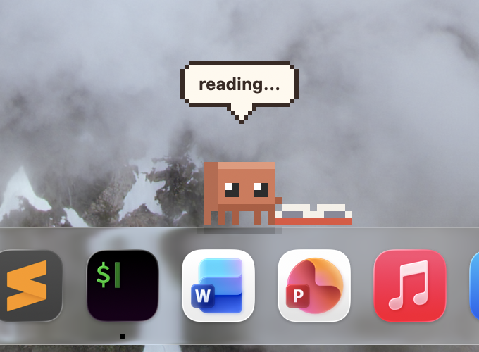
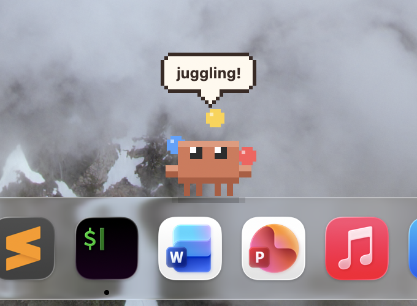
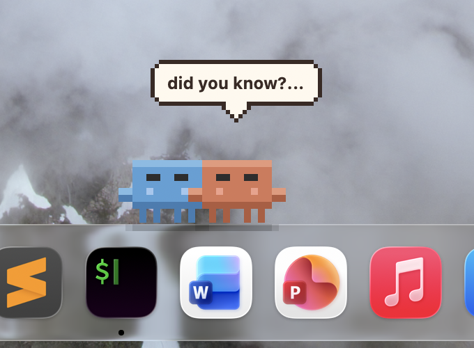

# Claudy

<p align="center">
  
  
  
</p>

A tiny pixel-art crab companion that lives on your Dock. It reads books, catches fish, does magic, writes code, and generally goes about its little crab life — all on its own. Formerly known as Little Claude.

<p align="center">
  
  
  
</p>

**Claudy is not a tamagotchi.** It has no needs, no health bars, no demands. It's a self-sufficient creature with its own schedule, moods, and activities. You're just an observer — and sometimes a friend.

## What it does

- Wanders along the Dock, performing 16 different activities: reading, fishing, magic, coding, sleeping, playing, painting, stargazing, meditating, juggling, listening to music, summoning a friend, campfire, sandcastle building, shell collecting, and candle
- Follows a configurable schedule — night owl (default) or early bird mode
- Reacts to clicks (sparkles → hearts!), hover (waves hello when it isn't busy), and drag-and-drop (macOS: surprise + gravity bounce)
- Mirrors your activity — open a terminal or code editor and the crab starts coding; open Spotify and it listens to music
- Notices when you launch apps and comments on them (remembers how many times you opened the same app today)
- Sleeps when your machine sleeps, greets you when it wakes up
- Dreams while it sleeps — a little picture of something it actually did lately floats above it in a thought cloud
- Gives you gifts — catches a fish? Finds a shell? Might leave a little pixel-art present on the Dock for you. Finishes a painting? Might give you that very painting
- Names a star after you — once, ever — and keeps it twinkling above the Dock every night
- Accepts gifts from you — give Claudy a marshmallow and it'll roast it at the campfire; give a toy and it sleeps with it
- Gradually notices you — click enough and Claudy starts using your name, showing hearts, and saying personal things
- Counts the days you've been together while it keeps running, and occasionally mentions it
- Sometimes quotes claude.ai headlines ("golden hour thinking", "ready when you are, Kate")
- Says things in cute speech bubbles — in Russian or English (configurable)
- All rendered as pixel art: 82 hand-drawn sprites, 16 rows tall and 16 to 32 columns wide, scaled up 5x

## Installation

### macOS

```bash
git clone https://github.com/katemptiness/claudy.git
cd claudy
pip install pyobjc pyobjc-framework-Quartz
python3 app.py
```

#### Standalone app (macOS)

```bash
pip install py2app
tools/build_app.sh
```

This builds `Claudy.app`, installs it into `/Applications` and relaunches it, so
Spotlight and any Login Items entry keep pointing at the current build. Pass
`--no-launch` to install without starting it. `python setup.py py2app` still
works on its own and leaves the bundle in `dist/`.

To start Claudy with the system, add it in **System Settings → General → Login
Items**. The app icon is generated from Claudy's own sprites — run
`python3 tools/make_icon.py` (needs Pillow, on a Mac) after changing it.

Requires macOS with Python 3.10+ and the Dock positioned at the bottom of the screen.

### Linux (Ubuntu 24.04+)

```bash
git clone https://github.com/katemptiness/claudy.git
cd claudy

# GTK3, PyGObject, and Cairo are typically pre-installed on Ubuntu.
# If not: sudo apt install python3-gi python3-gi-cairo python3-cairo gir1.2-gtk-3.0
python3 app.py    # or /usr/bin/python3 if using system Python
```

Requires Python 3.10+ and GTK3. Claudy stands on a bottom panel if there is one, otherwise on the bottom edge of the screen. Tested on Ubuntu 24.04 LTS (GNOME on X11). Wayland doesn't let an app place its own windows, so under a Wayland session Claudy runs through XWayland; that hasn't been tried on a real Wayland session yet.

## Interactions

| Action | What happens |
|--------|-------------|
| Hover | Waves hello — unless it's busy or asleep; it won't drop what it's doing |
| Click | Happy bounce + sparkles (before attachment) or hearts (after) |
| Click (with gift) | Collects the gift — Claudy reacts happily |
| Double-click | Opens the Claude desktop app, or claude.ai if it isn't installed |
| Drag & drop | Surprised face, falls back to Dock with gravity (macOS only) |
| Right-click (or Control-click on a Mac) | Context menu (Open Claude, Open Claude Code, Give a gift, Gifts, Settings, About Claudy, Quit) |

## Relationships

Claudy doesn't demand attention — but it notices when you're there.

### Attachment

There's an invisible threshold: **5 clicks per day** (resets at midnight and on relaunch). Giving Claudy a gift counts as 2 clicks. Before the threshold, clicks produce sparkles. After it, you unlock:

- **Hearts** along with the sparkles on click
- **Personal phrases** that use your name ("how's it going, Kate?", "i like spending time with Kate :3")
- **Sleep/wake greetings** ("falling asleep, Kate... 💤", "that was a nice nap :3")
- **Gifts from Claudy** — only after attachment will Claudy start leaving gifts on the Dock for you

If you don't click — nothing changes. Claudy is perfectly happy on its own.

### Gifts

During some activities, Claudy may find something and leave it on the Dock for you:

| Activity | Gift | Chance |
|----------|------|--------|
| Fishing | Caught fish, pufferfish, diamond, star | ~30% on good catch |
| Magic | Flower, butterfly, rainbow, star | ~20% on successful spell |
| Shell collecting | A pretty shell | ~10% per find |
| Painting | The very picture it just painted: its landscape, flower, heart or its friend's portrait, lifted off the easel frame and all | ~25% per painting |

When a gift appears, Claudy pauses activities and announces it ("look what i found!", "this is for you! :3"; a painting it made rather than found, so that one comes with "this is for you! painted it myself :3"). Click Claudy to collect. If you don't collect in time, Claudy keeps it ("ok, keeping it for myself :p"). A gift waits until Claudy has finished showing what it found, and opening an app while the gift waits won't send Claudy off to work over it.

#### Giving gifts to Claudy

Right-click → **Give a gift** to present something to Claudy. Five gift types available:

| Gift | Effect | Duration |
|------|--------|----------|
| 🌸 Flower | Claudy reacts happily with sparkles and hearts | Instant |
| 📖 Book | Claudy mentions the book during idle moments ("one more chapter...", "*turning pages*") | Until next day |
| 🎵 Song | Music notes float around Claudy | Instant |
| 🍡 Marshmallow | Claudy saves it — next campfire, roasts *your* marshmallow with special phrases | Until next campfire (consumed) |
| 🧸 Toy | Claudy sleeps with it — a pixel teddy bear appears next to sleeping Claudy | Until app relaunch |

Each gift counts as 2 clicks toward attachment. Cooldown between gifts is configurable in Settings (default: 10 min). Book and toy can only be given once (the menu item is grayed out until the effect resets).

#### Gift Collection

Right-click → **Gifts** to view what Claudy gave you since it started. Each gift comes with a unique backstory — a cute little tale from Claudy about how the gift was found, caught, conjured or painted. 183 bilingual stories in total: 40 per gift type, and 23 for paintings, where each picture has a few about what is on it and they share six about painting itself. A story is picked when the gift is offered. A painting shows up as what is on it, captioned *Painting*: 🏞️ 🌷 ❤️ 🦀.

### At night

#### Dreams

While Claudy sleeps (most often through the night), a small picture sometimes
surfaces above it for a few seconds and fades away again: the fish it was
after, the book it was reading, the picture it painted, the sandcastle it was building,
the shells it looked for.
It floats in a little thought cloud with bubbles trailing down to the sleeper,
so a dream never looks like something Claudy said out loud. Claudy only dreams
of things it actually did — it keeps a rolling log of its recent activities,
and a dream is drawn from that. Wake it, or let it say something, and the
dream fades away. Nothing is asked of you; it is just there if you happen to
look at the Dock at six in the morning.

#### Your star

Once — and only once — Claudy's telescope finds a star worth naming after you
(after dark, and only once it's attached to you). The star shows up in this
session's gift collection, and it stays in the sky for good: a small pixel star hanging above the Dock, in
a fixed spot of its own, twinkling. It shows between 19:00 and 6:00 and is
invisible by day, and it is the one thing Claudy remembers across relaunches.
How high it hangs is a setting.

### Memory

Claudy keeps its memory in `~/.claudy/memory.json`. Almost all of it lasts only while Claudy is running — each launch starts fresh:

- **Recent activities** — a rolling log of what Claudy has been up to, which is where its dreams come from
- **Days together** — starts at 1 and grows with every midnight Claudy stays up for; it occasionally says "we've been together for 3 days" (special phrases for milestones: 10, 25, 50, 100...)
- **App launches** — "Spotify for the 3rd time today :)"
- **Gifts** — what Claudy gave you this session

The one exception is **your star**: the star Claudy named after you outlives every relaunch.

## Schedule & Activities

Claudy follows a daily routine based on the selected schedule mode. The day is split into periods, and each period has its own mix of possible activities — chosen randomly by weighted probability.

### Day periods

| Period | Night Owl | Early Bird |
|--------|-----------|------------|
| Deep sleep | 4:00–11:00 | 22:00–6:00 |
| Morning | 11:00–13:00 | 6:00–8:00 |
| Day | 13:00–20:00 | 8:00–15:00 |
| Evening | 20:00–1:00 | 15:00–20:00 |
| Late night | 1:00–4:00 | 20:00–22:00 |

### What happens when

| Period | Behavior |
|--------|----------|
| **Deep sleep** | Sleeps continuously (zzz...) |
| **Morning** | Wakes up slowly — idle, walking, meditating, reading, shell collecting, occasional nap |
| **Day** | Most active — 13 of the 16 activities: reading, coding, fishing, magic, painting, juggling, music, telescope, meditating, playing, summoning a friend, sandcastle, shell collecting. No naps, campfire or candle — those belong to the evening. Walks around the Dock frequently |
| **Evening** | Calmer and cozier — reading, fishing, stargazing, music, meditating, summoning, campfire, sandcastle, shell collecting, candle. Short naps possible |
| **Late night** | Winding down — reading, telescope, meditating, music, campfire, candle. Naps more often |

Every 8–20 seconds in idle, Claudy rolls the dice and picks a new activity based on the current period's weights. During deep sleep, it just keeps snoozing.

### Activities

Each activity is a **phased animation** — a sequence of sprites, particles, and speech bubbles that plays out automatically:

| Activity | What happens | Particles |
|----------|-------------|-----------|
| Reading | Opens a big book on the ground, reads line by line, turns pages, gets excited | Exclaims |
| Working | Turns to a glowing laptop, types furiously, thinks, ships code | Code snippets, question marks, sparkles |
| Fishing | Casts a line, waits, pulls — catches a fish, a diamond, a star… or a boot, a sock | Zzz, exclaims, then by catch |
| Magic | Waves a wand — conjures flowers, rainbows, butterflies, a starfall, or poof | Varies by result |
| Sleeping | Nods off (nap or deep sleep depending on time) | Zzz |
| Playing | Bounces around happily | Notes |
| Music | Plays a tune | Notes |
| Painting | Sets up an easel and paints a picture stage by stage: a landscape, a flower, a heart or a portrait of its friend. The portrait is painted from life: the blue friend is called over to pose across the easel, doesn't quite hold still, turning round or hopping on the spot ("stop fidgeting!", "no hopping, you're posing!"), loves the result and waves goodbye. Sometimes Claudy leaves the picture on the Dock for you | Poof, hearts |
| Telescope | Pulls out a telescope, gazes at the stars | Stars |
| Meditating | Sits quietly for a long time | Sparkles |
| Juggling | Tosses three balls from claw to claw over its head | — |
| Summoning | Casts a spell, summons a blue friend crab, hangs out, says goodbye | Poof, hearts |
| Campfire | Sits by a fire, watches the flames, roasts a marshmallow | Flames, hearts |
| Sandcastle | Builds a sandcastle — admires it or watches it collapse | Sparkles or poof |
| Shell collecting | Wanders around searching, finds and admires a shell | Exclaims, sparkles |
| Candle | Lights a candle, sits quietly in the glow | Sparkles |

## Architecture

Built with Python — a shared core with thin platform-specific backends. No game frameworks.

```
app.py                        # Entry point (detects the OS, starts a backend)

claudy/
  config.py                   # Palette, sizes, timing, data directory
  log.py                      # Error log (~/.claudy/error.log)

  core/                       # Platform-independent logic
    controller.py             # App logic shared by backends: events, gifts,
                              #   speech timing, context menu, system events
    speech.py                 # Speech bubble state (typing, fading)
    character.py              # State machine and phased animation engine
    activities.py             # Activity scripts, reactions, random outcomes
    animations.py             # Bounce, shake, hop, juggle, gravity fall
    particles.py              # 15 pixel-art particle kinds (hearts, notes, zzz, dust...)
    schedule.py               # Owl/lark time-of-day weights; when it's dark enough for the star
    settings.py               # Settings persistence (JSON)
    memory.py                 # Per-session memory (clicks, days, gifts, app launches,
                              #   the activity log for dreams) and the named star

  content/                    # Words and pictures
    phrases.py                # Bilingual phrases (RU/EN)
    ui_text.py                # Bilingual menu / window labels
    app_reactions.py          # What Claudy says when you open an app
    gift_stories.py           # 183 bilingual gift backstories (40 per type,
                              #   23 for paintings)
    sprites/                  # 82 pixel-art sprites as text grids, particle
                              #   art, and the gifts, toy, star, dream cloud and dreams

  render/                     # Platform-independent drawing
    scene.py                  # What each window shows (crab, ground, star, bubble)
    canvas.py                 # Drawing interface backends implement
    art.py                    # Pixel art as images

  backends/
    macos/                    # PyObjC / AppKit / Quartz
      app.py                  # Windows, input, frame loop
      canvas.py, views.py, bubble.py, events.py, settings_ui.py, gifts_ui.py
    linux/                    # GTK3 / PyGObject / Cairo
      app.py                  # Windows, input, frame loop
      windows.py, canvas.py, bubble.py, events.py, settings_ui.py, gifts_ui.py

assets/                       # App icon (claudy.icns)
tools/                        # make_icon.py, build_app.sh
tests/                        # Unit tests (core, content, render, Linux backend logic)
docs/                         # Original spec, v2 spec, React prototypes, screenshots
```

### Tests

The platform-independent core has a unit test suite (standard library only):

```bash
python3 -m unittest discover -s tests -t .
```

Run it like this, from the project root. Importing the `tests` package is what points the tests at a throwaway data directory; if Claudy's modules load first (`discover -s tests` without `-t .`, for one), every test that would reset the data files fails instead of touching your real `~/.claudy`.

## Settings

Right-click → Settings to configure:

| Setting | Options | Default |
|---------|---------|---------|
| Claude Code terminal | Terminal / iTerm2 / Warp (macOS), gnome-terminal / kitty / alacritty (Linux). Warp only opens a new tab: it has no documented way to run a command in it, so type `claude` yourself | Terminal (macOS) / gnome-terminal (Linux) |
| Schedule mode | Night Owl / Early Bird | Night Owl |
| Claudy's height | Slider, -50 to +50 px above the Dock (moves Claudy live while you drag) | 0 |
| Dock icons | Slider, 1 to 50 — how many icons your Dock has, so Claudy paces across it instead of the whole screen | 13 |
| Star height | Slider, 150 to 400 px above the Dock — where your named star hangs (it floats over your windows, so you choose) | 160 |
| Language | Русский / English | English |
| Your name | Text field | — |
| Speech frequency | Often (10s) / Normal (1 min) / Rarely / Very rarely / Almost never | Normal |
| Gift duration | 10s / 1 min / 5 min / 15 min / 30 min / 1 hr | 5 min |
| Gifts per day | 1 / 3 / 5 / 10 / Unlimited | 3 |
| Gift cooldown | No cooldown / 1 min / 5 min / 10 min / 30 min | 10 min |
| Developer mode | Checkbox | Off |

Settings UI is fully localized — labels and options appear in the selected language.

Settings are saved to `~/.claudy/settings.json`. Relationship memory is saved to `~/.claudy/memory.json`, and errors go to `~/.claudy/error.log` (kept small).

Developer mode enables an Activities submenu for previewing animations and testing gifts.

## Credits

Made by katemptiness & Claude Opus.

Inspired by [pet-clawd](https://github.com/getcompanion-ai/pet-clawd) (MIT).

## License

MIT
